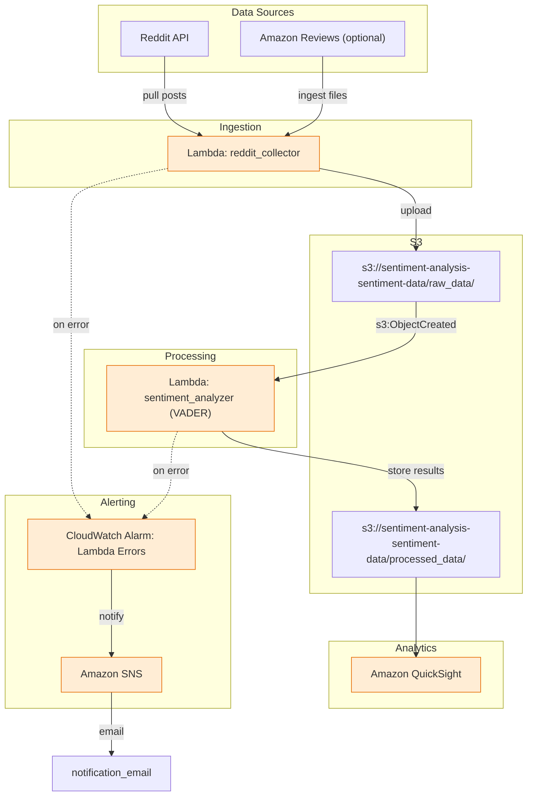

<!--
Updated README: includes quickstart, security steps, packaging guidance and
links to the architecture diagram. Keep sensitive instructions in the
security section and do not commit secrets to the repository.
-->

# AWS Sentiment Analysis Pipeline

A Terraform + AWS Lambda pipeline that collects Reddit data, processes it,
and scores sentiment using a local VADER lexicon. This repository contains
infrastructure (Terraform) and Lambda code used for data collection,
processing, and basic visualization with QuickSight.

## Quick highlights
- Data collection: Reddit (PRAW)
- Processing: AWS Lambda functions
- Analysis: VADER sentiment scoring (positive/neutral/negative + compound score), run inside the `sentiment_analyzer` Lambda — no training data required
- Storage: S3 (raw and processed buckets)
- Alerting: CloudWatch alarms on Lambda errors, notified via SNS email
- IaC: Terraform

---

## Quickstart (developer)

1. Clone the repo:

```bash
git clone git@github.com:dhamsey3/aws-sentiment-analyzer.git
cd aws-sentiment-analyzer
```

2. Secure your secrets *outside* the repo (do NOT commit them):

- Create `terraform/backend.tf.local` with your S3/DynamoDB backend (see `terraform/backend.tf`).
- Store Reddit credentials in AWS Secrets Manager or pass them via your CI environment.

3. Produce lambda artifacts (locally or in CI). This installs each function's
   `requirements.txt` into a scratch build directory and zips it — nothing
   gets installed into or committed from the source folders:

```bash
./deploy_lambdas.sh
```

4. Initialize Terraform with your local backend and plan:

```bash
terraform init -backend-config=terraform/backend.tf.local
terraform plan
# Review the plan and then apply in a controlled account
terraform apply
```

---

## Security & housekeeping (must-read before pushing)

1. Rotate exposed keys immediately if they were ever committed.
2. Stop tracking local state/files and remove them from the index:

```bash
git rm --cached terraform/terraform.tfstate terraform/terraform.tfstate.backup terraform/terraform.tfvars || true
git add .gitignore
git commit -m "Ignore terraform state/vars and lambda artifacts"
```

3. Purge secrets from git history (work on a clone/mirror):

- Recommended: `git-filter-repo` — follow its documentation and test on a mirror before force-pushing.
- Alternative: BFG Repo-Cleaner.

4. Migrate state to a remote backend (create the S3 bucket + DynamoDB table first), then run:

```bash
terraform init -migrate-state -backend-config=terraform/backend.tf.local
```

5. Packaging: do not commit third-party libraries. Use a build script or CI to produce zip artifacts. Use Lambda Layers for shared dependencies.

---

## Project layout

```
.
├── terraform/                # Terraform configuration
├── terraform/lambda/         # Lambda source folders and produced zip artifacts
├── deploy_lambdas.sh         # Packaging helper (produces terraform/lambda/*.zip)
├── docs/                     # Documentation (architecture diagram)
└── README.md
```

## Architecture diagram
Below is an inline Mermaid diagram showing the architecture and data flow. GitHub renders Mermaid blocks in README files — the same diagram is also available in `docs/architecture.md`.



---

## Next steps / TODO

- Move secrets into Secrets Manager or Parameter Store and reference them from Terraform
- Deduplicate Reddit posts across daily collection runs (currently re-scores whatever is "hot" that day, which can overlap with prior runs)

### Artifact bucket & IAM

CI uploads lambda artifacts to an S3 bucket. Create a bucket and grant the CI user (or role) PutObject permissions. Example Terraform snippet to create the artifact bucket:

```hcl
resource "aws_s3_bucket" "lambda_artifacts" {
	bucket = "aws-sentiment-analyzer-lambda-artifacts"
	acl    = "private"
	server_side_encryption_configuration {
		rule {
			apply_server_side_encryption_by_default {
				sse_algorithm = "AES256"
			}
		}
	}
}
```

Example minimal IAM policy for the CI user (grant PutObject/GetObject/ListBucket on the artifact bucket and DynamoDB/Put for state migration as needed):

```json
{
	"Version": "2012-10-17",
	"Statement": [
		{
			"Effect": "Allow",
			"Action": [
				"s3:PutObject",
				"s3:GetObject",
				"s3:ListBucket"
			],
			"Resource": [
				"arn:aws:s3:::aws-sentiment-analyzer-lambda-artifacts",
				"arn:aws:s3:::aws-sentiment-analyzer-lambda-artifacts/*"
			]
		}
	]
}
```

## License

MIT

