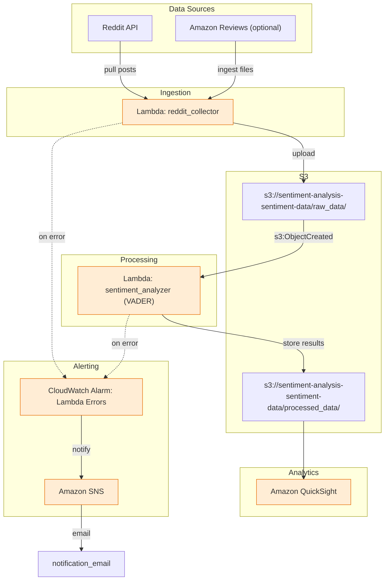

# Architecture

This document contains a Mermaid diagram describing the high-level architecture and data flow for the AWS Sentiment Analysis pipeline.

```mermaid
flowchart TD
  subgraph DataSources[Data Sources]
    Reddit["Reddit API"]
    Reviews["Amazon Reviews (optional)"]
  end

  subgraph Ingestion[Ingestion]
    RC[Lambda: reddit_collector]
  end

  subgraph Storage[S3]
    RawBucket["s3://sentiment-analysis-sentiment-data/raw_data/"]
    ProcessedBucket["s3://sentiment-analysis-sentiment-data/processed_data/"]
  end

  subgraph Processing[Processing]
    SA["Lambda: sentiment_analyzer (VADER)"]
  end

  subgraph Analytics[Analytics]
    QuickSight[Amazon QuickSight]
  end

  subgraph Alerting[Alerting]
    Alarm[CloudWatch Alarm: Lambda Errors]
    SNS[Amazon SNS]
  end

  Reddit -->|pull posts| RC
  Reviews -->|ingest files| RC
  RC -->|upload| RawBucket
  RawBucket -->|s3:ObjectCreated| SA
  SA -->|store results| ProcessedBucket
  ProcessedBucket --> QuickSight
  RC -.->|on error| Alarm
  SA -.->|on error| Alarm
  Alarm -->|notify| SNS
  SNS -->|email| Notify["notification_email"]

  classDef awsService fill:#FFEDD5,stroke:#E66A00,stroke-width:1px;
  class RC,SA,QuickSight,Alarm,SNS awsService;
```
